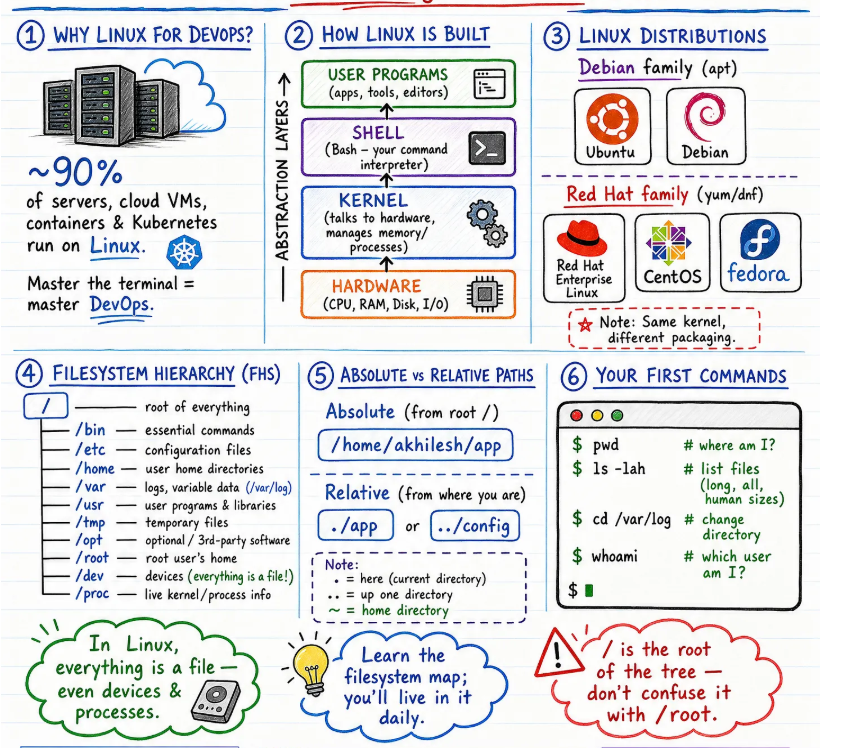

# Module 1 - Foundations 🐧

Start here if the terminal still feels like a black box. This module builds the mental model you need before anything else: how Linux is structured, where files live, and the handful of commands you'll type every single day.

## Day 1 — Linux Fundamentals & Filesystem

Why ~90% of servers run Linux, how the system is layered (hardware → kernel → shell → user programs), the Debian vs Red Hat families, and the Filesystem Hierarchy (`/usr/bin`, `/usr/sbin`, `/etc`, `/home`, `/var`, `/proc`).

> 💡 **Tip:** `/` is the root of the tree — don't confuse it with `/root`.



---

### 1️⃣ Why Linux for DevOps?

**~90%** of servers, cloud VMs, containers & Kubernetes run on Linux.

> Master the terminal = master DevOps.

---

### 2️⃣ How Linux is Built

Linux is organized in abstraction layers, each one talking only to the layer directly below it:

```
┌─────────────────────────────────────────┐
│           USER PROGRAMS                  │  ← apps, tools, editors
├─────────────────────────────────────────┤
│              SHELL                       │  ← Bash: your command interpreter
├─────────────────────────────────────────┤
│              KERNEL                      │  ← talks to hardware, manages
│                                           │    memory/processes
├─────────────────────────────────────────┤
│             HARDWARE                     │  ← CPU, RAM, Disk, I/O
└─────────────────────────────────────────┘
```

---

### 3️⃣ Linux Distributions

| Family | Package Manager | Distributions |
|---|---|---|
| **Debian family** | `apt` | Ubuntu, Debian |
| **Red Hat family** | `yum` / `dnf` | Red Hat Enterprise Linux, CentOS, Fedora |

> ⭐ **Note:** Same kernel, different packaging.

---

### 4️⃣ Filesystem Hierarchy (FHS)

```
/                    — root of everything
├── /bin             — essential commands
├── /etc             — configuration files
├── /home            — user home directories
├── /var             — logs, variable data (/var/log)
├── /usr             — user programs & libraries
├── /tmp             — temporary files
├── /opt             — optional / 3rd-party software
├── /root            — root user's home
├── /dev             — devices (everything is a file!)
└── /proc            — live kernel/process info
```

> 🐧 In Linux, **everything is a file** — even devices & processes.

---

### 5️⃣ Absolute vs Relative Paths

**Absolute** (from root `/`):
```
/home/akhilesh/app
```

**Relative** (from where you are):
```
./app       # or
../config
```

**Note:**
- `.` = here (current directory)
- `..` = up one directory
- `~` = home directory

> 💡 Learn the filesystem map; you'll live in it daily.

---

### 6️⃣ Your First Commands

```bash
$ pwd            # where am I?
$ ls -lah        # list files (long, all, human sizes)
$ cd /var/log    # change directory
$ whoami         # which user am I?
```

> ⚠️ `/` is the root of the tree — don't confuse it with `/root`.

---
