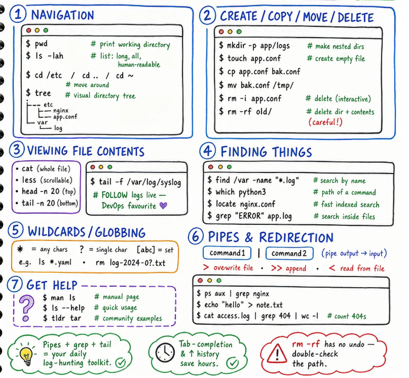

# Day 2 - Essential Commands & Navigation ⌨️

The daily toolkit: `pwd`, `ls -lah`, `cd`, `tree`, plus create/copy/move/delete, viewing files (`cat`, `less`, `head`, `tail -f`), finding things (`find`, `grep`, `locate`), wildcards, and pipes & redirection.

> ⚠️ `locate` uses a database and may require `updatedb` before finding recently created files.

> 💡 **Tip:** Pipes + `grep` + `tail` become your log-hunting toolkit — and `rm -rf` has no undo, so always double-check the path.



---

### 1️⃣ Navigation

```bash
$ pwd                  # print working directory
$ ls -lah              # list: long, all, human-readable

$ cd /etc  /  cd ..  /  cd ~
                        # move around

$ tree                 # visual directory tree
.
├── etc
│   ├── nginx
│   └── app.conf
└── var
    └── log
```

---

### 2️⃣ Create / Copy / Move / Delete

```bash
$ mkdir -p app/logs     # make nested dirs
$ touch app.conf        # create empty file
$ cp app.conf bak.conf
$ mv bak.conf /tmp/
$ rm -i app.conf        # delete (interactive)
$ rm -rf old/           # delete dir + contents (careful!)
```

---

### 3️⃣ Viewing File Contents

| Command | Description |
|---|---|
| `cat` | whole file |
| `less` | scrollable |
| `head -n 20` | top |
| `tail -n 20` | bottom |

```bash
$ tail -f /var/log/syslog
# FOLLOW logs live — DevOps favourite 💜
```

---

### 4️⃣ Finding Things

```bash
$ find /var -name "*.log"    # search by name
$ which python3              # path of a command
$ locate nginx.conf          # fast indexed search
$ grep "ERROR" app.log       # search inside files
```

---

### 5️⃣ Wildcards / Globbing

| Wildcard | Meaning |
|---|---|
| `*` | any chars |
| `?` | single char |
| `[abc]` | set |

```bash
$ ls *.yaml
$ rm log-2024-0?.txt
```

---

### 6️⃣ Pipes & Redirection

```
command1 | command2      # pipe output → input
> overwrite file    •    >> append    •    < read from file
```

```bash
$ ps aux | grep nginx
$ echo "hello" > note.txt
$ cat access.log | grep 404 | wc -l   # count 404s
```

---

### 7️⃣ Get Help

```bash
$ man ls              # manual page
$ ls --help           # quick usage
$ tldr tar            # community examples
```

---

### Key Takeaways

- 🔥 **Pipes + `grep` + `tail`** = your daily log-hunting toolkit. ✅
- ⏱️ **Tab-completion & ↑ history** save hours. ✅
- ⚠️ **`rm -rf` has no undo** — double-check the path.

---
