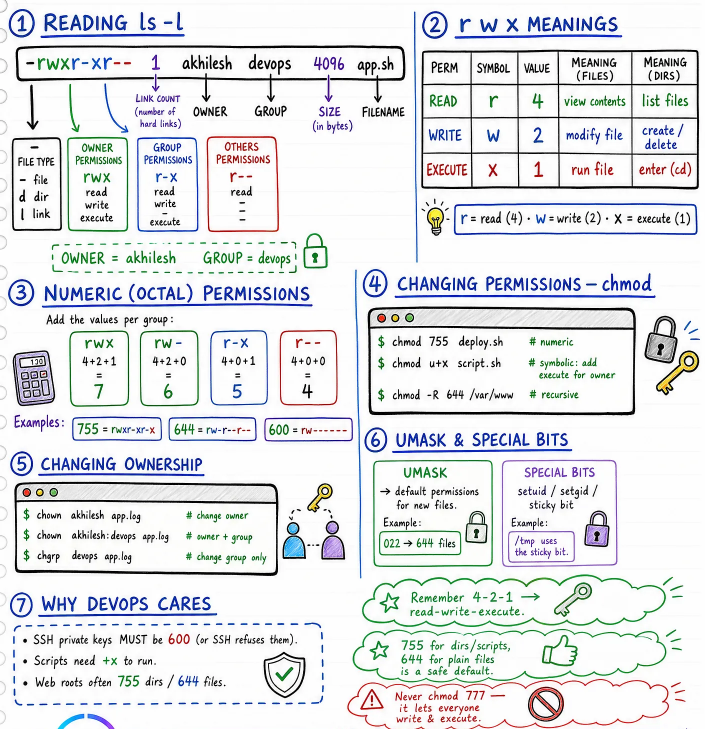
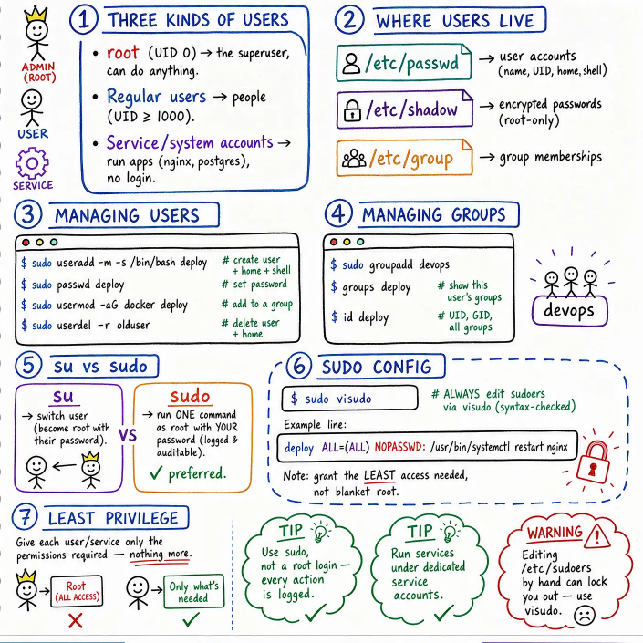
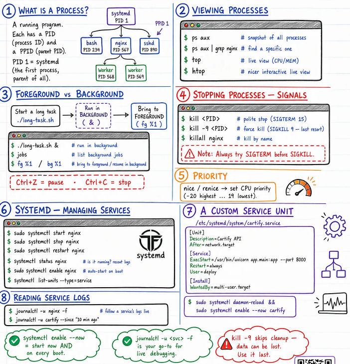
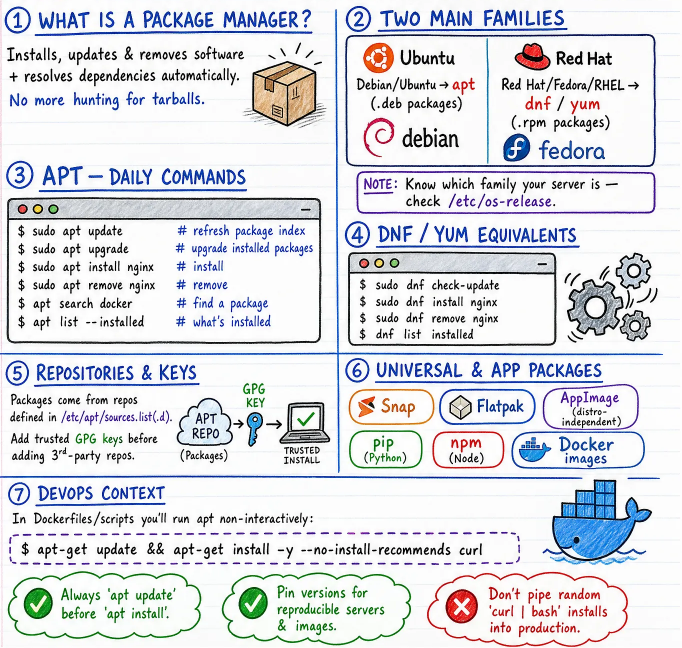
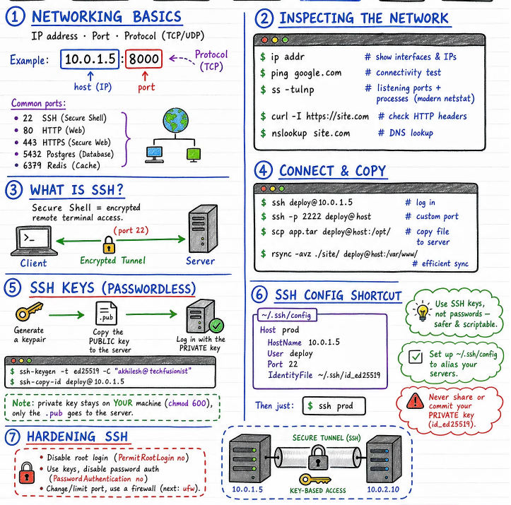

# Linux for DevOps — Days 3 to 10 🐧

A simple day-by-day reference covering system administration, networking, and production readiness.

---

## Module 2 - System & User Management

### Day 3 - File Permissions & Ownership

Reading `ls -l`, the `rwx` model, numeric (octal) permissions, `chmod`, `chown`/`chgrp`, umask and special bits.



**Key commands:**
```bash
chmod 755 deploy.sh       # numeric
chmod u+x script.sh       # symbolic
chown akhilesh:devops app.log
```

> 💡 Remember **4-2-1** (read-write-execute). Avoid `chmod 777`. SSH keys need `600`.

---

### Day 4 - Users, Groups & sudo

The three kinds of users (root, regular, service accounts), where users live (`/etc/passwd`, `/etc/shadow`, `/etc/group`), managing users/groups, `su` vs `sudo`, and editing sudoers safely with `visudo`.



**Key commands:**
```bash
sudo useradd -m -s /bin/bash deploy
sudo usermod -aG docker deploy
sudo groupadd devops
sudo visudo                # always edit sudoers this way
```

> 💡 Golden rule: grant the **least access needed**, never blanket root. Password hashes live in `/etc/shadow`, not `/etc/passwd`.

---

### Day 5 - Process Management & systemd

What a process is (PID, PPID, PID 1 = systemd), viewing processes (`ps`, `top`, `htop`), foreground vs background jobs, signals (`SIGTERM` before `SIGKILL`), priority with `nice`, and managing services with `systemctl`/`journalctl`.



**Key commands:**
```bash
ps aux | grep nginx
kill <PID>                 # polite stop
kill -9 <PID>               # force kill (last resort)
sudo systemctl restart nginx
journalctl -u nginx -f
```

> 📝 On most modern distros, systemd runs as PID 1.
> 💡 `systemctl enable --now` and `journalctl -u <svc> -f` become muscle memory.

---

## Module 3 - System & Network Admin

### Day 6 - Package Management & Software

What a package manager does, the two families (`apt` for Debian/Ubuntu, `dnf`/`yum` for Red Hat/Fedora), daily commands, repositories & GPG keys, and universal packages (Snap, Flatpak, pip, npm, Docker images).



**Key commands:**
```bash
sudo apt update && sudo apt upgrade
sudo apt install nginx
sudo dnf install nginx      # Red Hat equivalent
```

> 💡 Always `apt update` before `apt install` — never pipe a random `curl | bash` into production.

---

### Day 7 - Networking & SSH Essentials

IP + port + protocol, common ports (22, 80, 443, 5432, 6379, 53, 3306), inspecting the network (`ip addr`, `ss -tulnp`, `curl -I`, `nslookup`), connecting and copying (`ssh`, `scp`, `rsync`), passwordless SSH keys, the `~/.ssh/config` shortcut, and hardening SSH.



**Key commands:**
```bash
ip addr
ss -tulnp
ssh deploy@10.0.1.5
scp app.tar deploy@host:/opt/
ssh-keygen -t ed25519 -C "you@example.com"
ssh-copy-id deploy@host
```

> 💡 Your private key stays on your machine (`chmod 600`) — only the `.pub` goes to the server.

---

## Module 4 - Production Readiness

### Day 8 - Bash Shell Scripting

Anatomy of a script (shebang, `set -euo pipefail`), variables & arguments, conditions, loops, functions & exit codes, a real log-backup script, and scheduling with `cron`.

> 📝 Cron remains widely used, though modern distros also support systemd timers.
> 💡 Quote your variables (`"$VAR"`) to avoid word-splitting bugs — always test in staging before scheduling on prod.

---

### Day 9 - Text Processing & Log Analysis

The power chain every engineer leans on: `grep | awk | sort | uniq -c | sort -rn | jq`. Search with `grep`, slice columns with `awk`, find-and-replace with `sed`, and combine `cut`/`sort`/`uniq`/`wc` for instant answers from messy logs.

```bash
cat access.log | grep 404 | awk '{print $1}' | sort | uniq -c | sort -rn
```

> 💡 When something breaks, read the logs first.

---

### Day 10 - Security, Hardening & Troubleshooting

Locking a server down with firewalls, SSH hardening recap, keeping the system patched, the least-privilege checklist, a step-by-step troubleshooting playbook (status → logs → ports → resources), and resource health checks.

> 💡 Harden before you expose a server to the internet.
> 💡 Disable password authentication and prefer SSH keys whenever possible.

---

## Quick Reference — All Days

| Day | Topic |
|---|---|
| 3 | File Permissions & Ownership |
| 4 | Users, Groups & sudo |
| 5 | Process Management & systemd |
| 6 | Package Management & Software |
| 7 | Networking & SSH Essentials |
| 8 | Bash Shell Scripting |
| 9 | Text Processing & Log Analysis |
| 10 | Security, Hardening & Troubleshooting |

---
