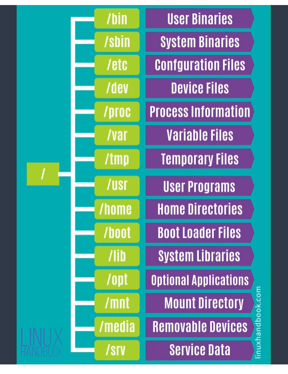
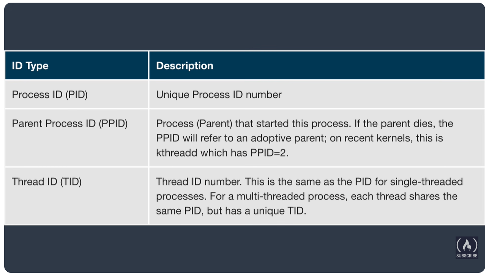
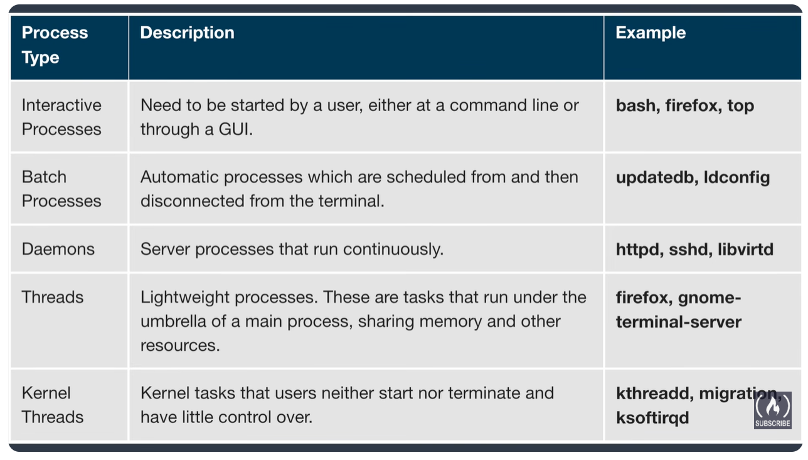
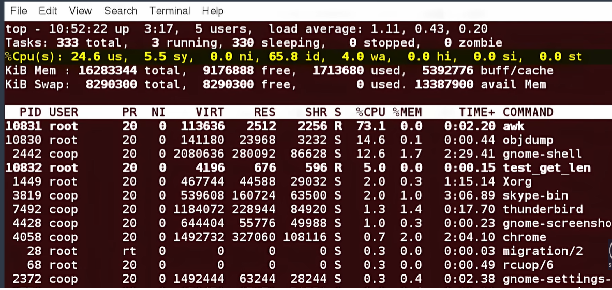

# Linux Complete Notes — From Boot to Bash 🐧

A beginner-friendly, detailed reference covering everything from "what is Linux" to permissions, processes, and I/O redirection — written so it makes sense the very first time you read it.

---

## Table of Contents

1. [What is Linux?](#1-what-is-linux)
2. [Linux Distributions](#2-linux-distributions)
3. [Linux Architecture](#3-linux-architecture)
4. [Boot Process — BIOS → MBR → GRUB → Kernel → systemd](#4-boot-process)
5. [Folder / Filesystem Hierarchy](#5-folder-management)
6. [User & Group Management](#6-user-management)
7. [Permissions Deep Dive — chmod, chown, inode](#7-permissions-deep-dive)
8. [Real Permission Walkthrough (the HEMANTH:dev example)](#8-real-permission-walkthrough)
9. [Navigation Shortcuts — cd -, pushd/popd](#9-navigation-shortcuts)
10. [Standard I/O Streams & Redirection](#10-io-redirection)
11. [Pipes & Wildcards](#11-pipes--wildcards)
12. [Process Management — PID, PPID, top, nice, jobs](#12-process-management)
13. [Disk & Filesystem Operations — fdisk, mount, NFS](#13-disk--filesystem-operations)
14. [curl & wget](#14-curl--wget)

---

## 1. What is Linux?

**Linux is a free, open-source operating system kernel** — the core piece of software that talks directly to your computer's hardware (CPU, memory, disk) and lets every other program run on top of it.

**Where it came from:**
- In 1991, a Finnish student named **Linus Torvalds** wrote a small kernel as a personal project, inspired by an older OS called **UNIX** (from the 1970s, built at Bell Labs).
- He released it publicly and for free, and thousands of developers worldwide started contributing to it.
- Because it's open-source (anyone can read/modify/redistribute the code), companies and communities took the Linux **kernel** and wrapped it with their own tools, package managers, and software — creating different **"distributions" (distros)**.

**Key idea:** "Linux" technically refers only to the **kernel**. What you actually install and use (Ubuntu, Fedora, etc.) is a **distribution** — the kernel plus a bundle of software, package managers, and configuration choices built around it.

```
        UNIX (1970s)
             │
     inspired the creation of
             │
             ▼
     Linux Kernel (1991, Linus Torvalds)
             │
   different teams package it differently
             │
    ┌────────┼────────┬────────────┐
    ▼        ▼        ▼            ▼
 Ubuntu   Debian   Red Hat      Fedora   ... (distributions)
```

---

## 2. Linux Distributions

A **distribution (distro)** = Linux kernel + package manager + default software + configuration philosophy.

| Family | Package Manager | Package Format | Examples |
|---|---|---|---|
| **Debian family** | `apt` | `.deb` | Ubuntu, Debian |
| **Red Hat family** | `yum` / `dnf` | `.rpm` | Red Hat Enterprise Linux (RHEL), CentOS, Fedora |

**Why it matters in real life:** the command you use to install software depends entirely on which family your server belongs to.

```bash
# On Ubuntu/Debian
sudo apt install nginx

# On Red Hat/Fedora/CentOS
sudo dnf install nginx
```

> ⭐ Same underlying kernel, different packaging and tooling. Always check `/etc/os-release` if you're unsure which distro you're on:
> ```bash
> cat /etc/os-release
> ```

---

## 3. Linux Architecture

Think of Linux as **layers**, where each layer only talks to the layer directly next to it — you (the user) never touch the hardware directly, the kernel does that for you.

```
┌───────────────────────────────────────────┐
│              USER / APPLICATIONS           │   ← firefox, vim, python, your apps
├───────────────────────────────────────────┤
│                  SHELL                      │   ← bash, zsh — interprets your commands
├───────────────────────────────────────────┤
│                  KERNEL                     │   ← manages CPU, memory, processes, devices
│   (process mgmt, memory mgmt, device        │
│    drivers, filesystem, network stack)      │
├───────────────────────────────────────────┤
│                 HARDWARE                    │   ← CPU, RAM, Disk, Network card
└───────────────────────────────────────────┘
```

**What each layer actually does:**
- **Hardware** — the physical machine: CPU (does the calculations), RAM (short-term memory), Disk (storage), I/O devices.
- **Kernel** — the "manager." It decides which process gets CPU time, allocates memory, talks to disk/network drivers, and enforces permissions. You never call the kernel directly — you go through it via system calls.
- **Shell** — a program (like Bash) that reads what you type, translates it into system calls the kernel understands, and shows you the result. It's your command-line interpreter.
- **User/Applications** — everything you run: browsers, editors, scripts, servers.

---

## 4. Boot Process — BIOS → MBR → GRUB → Kernel → systemd

This is **what happens the second you power on a Linux machine**, in order:

```
 POWER ON
    │
    ▼
┌─────────┐     ┌─────────┐     ┌─────────┐     ┌─────────┐     ┌──────────┐
│  BIOS   │ ──▶ │   MBR   │ ──▶ │  GRUB   │ ──▶ │ KERNEL  │ ──▶ │ systemd  │
└─────────┘     └─────────┘     └─────────┘     └─────────┘     └──────────┘
 hardware        boot loader     lets you        loads OS        starts all
 self-check      location        pick OS/        into memory     services
                                  kernel
```

### BIOS — Basic Input Output System
The very first thing that runs when you power on the machine. It lives on a chip on the motherboard (not on your hard disk). Its job: run a quick hardware self-check (POST — Power-On Self-Test) and then find a bootable device (your disk, USB, etc.).

### MBR — Master Boot Record
A tiny, special section (512 bytes) at the very beginning of your bootable disk. **This is where the bootloader lives.** BIOS hands control over to whatever code is sitting in the MBR.

### GRUB — GRand Unified Bootloader
The actual bootloader program. Its job: **let you choose which OS or kernel to boot** if there's more than one. This is why a single machine can dual-boot two operating systems (e.g. Ubuntu + Windows) — GRUB shows you a menu at startup and you pick one.

```
GRUB menu example:
┌────────────────────────────┐
│ Ubuntu 22.04                │  ← highlighted = default
│ Ubuntu 22.04 (recovery mode)│
│ Windows 11                   │
└────────────────────────────┘
```

### Kernel — the actual Operating System
Once you (or GRUB automatically) pick an OS, GRUB loads the **kernel** into RAM. The kernel initializes hardware drivers, mounts the root filesystem, and starts the very first process on the system.

### systemd / systemctl — process & service management
The kernel starts exactly one process first: **`systemd`** (PID 1 — Process ID 1, the "parent of all processes"). `systemd` then starts every other service your system needs: networking, SSH, cron, your web server, etc.

```bash
sudo systemctl start nginx      # start a service
sudo systemctl status nginx     # check status
sudo systemctl enable nginx     # auto-start on boot
```

**Real-world summary in one line:** BIOS finds the disk → MBR holds the bootloader → GRUB lets you pick an OS/kernel → the kernel boots up and hands control to systemd → systemd starts every background service your Linux box runs.

---

## 5. Folder Management

Linux organizes everything under a single root directory `/` (not separate drive letters like Windows' `C:\`, `D:\`).



### The folders you asked about, explained with a Windows comparison:

| Folder | What it holds | Windows equivalent (rough) |
|---|---|---|
| `/etc` | **Configuration files** for the system and installed software | `C:\Program Files\...\config` — settings files |
| `/var` | **Logs and variable data** — things that constantly change (logs, mail queues, caches) | `C:\ProgramData` — app data that changes over time |
| `/bin` | **Binary/executable files** — the actual programs you run (`ls`, `cat`, `cp`) | `C:\Windows\System32` — core executables |

**Real example:**
```bash
$ ls /etc/nginx/          # nginx's configuration files live here
nginx.conf  sites-available  sites-enabled

$ ls /var/log/             # nginx's logs live here
nginx/  syslog  auth.log

$ which nginx               # the actual nginx binary/program
/usr/sbin/nginx
```

Other important folders from the diagram:

| Folder | Purpose |
|---|---|
| `/sbin` | System binaries (admin-only commands like `reboot`, `iptables`) |
| `/dev` | Device files (in Linux, even hardware devices appear as files!) |
| `/proc` | Live, virtual info about running processes and kernel state |
| `/tmp` | Temporary files, usually wiped on reboot |
| `/usr` | User-installed programs and libraries |
| `/home` | Every regular user's personal folder (`/home/hemanth`) |
| `/boot` | Bootloader files (this is where GRUB's files actually live!) |
| `/lib` | Shared system libraries that programs depend on |
| `/opt` | Optional/third-party software (not part of the base OS) |
| `/mnt` | Where you manually mount extra disks/drives |
| `/media` | Where removable devices (USB, DVD) auto-mount |
| `/srv` | Data for services the machine hosts (e.g. web server data) |

---

## 6. User Management

### Creating users and groups

```bash
sudo groupadd devops                          # create a group

sudo useradd -m -s /bin/bash user1            # create user1, with home dir + bash shell
sudo useradd -m -s /bin/bash user2

sudo usermod -aG devops user1                 # add user1 to devops group
sudo usermod -aG devops user2

sudo userdel -r user1                         # delete a user AND their home dir
sudo groupdel devops                          # delete a group
```

**Breaking down each flag:**
- `-m` → also create a home directory (`/home/user1`)
- `-s /bin/bash` → set their default shell to bash
- `-aG <group>` → **a**ppend to a **G**roup (never use plain `-G`, it wipes their other group memberships)
- `-r` on `userdel` → **r**emove their home directory too, not just the account

### Where user data actually lives

| File | What's stored |
|---|---|
| `/etc/passwd` | Basic user account info: username, UID, home directory, default shell (world-readable, no passwords here) |
| `/etc/shadow` | **Encrypted password hashes** — root-only readable, this is the actual secret data |
| `/etc/group` | Group definitions and which users belong to which group |
| **`/etc/sudoers`** | Defines **who can run commands as root/other users, and which commands** — this is the permissions file, separate from account info |

**Real example — look at your own entry:**
```bash
$ grep hemanth /etc/passwd
hemanth:x:1000:1000:Hemanth:/home/hemanth:/bin/bash
```
Breaking this down (colon-separated fields):
```
hemanth   :  x  :  1000 : 1000 : Hemanth : /home/hemanth : /bin/bash
username     ^      UID    GID    comment   home dir        shell
             │
      password placeholder (actual hash is in /etc/shadow, not here)
```

### INODE — what it actually is

An **inode** (index node) is a data structure that stores **all the metadata about a file** — EXCEPT the filename and the actual content.

An inode stores:
- File size
- Owner (user + group)
- Permissions (rwx)
- Timestamps (created, modified, accessed)
- Pointers to where the actual data blocks live on disk

**The filename is NOT stored in the inode** — it's stored separately in the directory, which just maps "filename → inode number." This is why you can have multiple filenames pointing to the same inode (hard links), and why renaming a file is instant (you're just changing the directory entry, not moving any data).

```bash
$ ls -i app.sh
884521  app.sh          # 884521 is the inode number
```

### Types of users (the 3-way split in every permission)

Every file's permissions are split into exactly three groups:

1. **User (Owner)** — the single person who owns the file
2. **Group** — everyone in the file's assigned group
3. **Others** — literally everyone else with access to the system

```
r w x   r w x   r w x
─────   ─────   ─────
 USER    GROUP  OTHERS
```

---

## 7. Permissions Deep Dive

### Reading a permission string

```
-rwxrwxrwx   hemanth:dev   file1.txt
│└─┬─┘└─┬┘└┬┘  │      │        │
│  │    │  │   │      │        └─ filename
│  │    │  │   │      └────────── group
│  │    │  │   └───────────────── owner (user)
│  │    │  └──────────────────── OTHERS permissions
│  │    └─────────────────────── GROUP permissions
│  └──────────────────────────── OWNER permissions
└─────────────────────────────── file type (- = file, d = directory, l = link)
```

### chmod — CHange MODe (permissions)

```bash
chmod +x script.sh          # add execute for EVERYONE (user, group, others)
chmod u+x script.sh         # add execute for OWNER only
chmod g+x script.sh         # add execute for GROUP only
chmod o-w file.txt          # remove write for OTHERS
chmod 755 deploy.sh         # numeric: owner=rwx, group=r-x, others=r-x
```

| Symbol | Value |
|---|---|
| `r` (read) | 4 |
| `w` (write) | 2 |
| `x` (execute) | 1 |

Add them per group to get numbers like `7` (rwx), `5` (r-x), `4` (r--).

### chown — CHange OWNer

```bash
chown hemanth app.log             # change owner only
chown hemanth:devops app.log      # change owner AND group
chgrp devops app.log              # change group only (dedicated command)
```

---

## 8. Real Permission Walkthrough

You asked a great real-world question — let's answer it precisely.

> **Scenario:** You log in as `HEMANTH`, and your primary/supplementary group is `dev`.
> The file shows: `----RWX---  HEMANTH:dev  file1.txt`
> **Question: can you access this file?**

Let's decode the permission string first:
```
----RWX---
│└┬┘└┬┘└┬┘
│ │  │  └── OTHERS: no permissions (---)
│ │  └───── GROUP:  read, write, execute (RWX)
│ └──────── OWNER:  no permissions (----   → the "-" before RWX means owner has nothing)
└────────── file type dash (regular file)
```

So: **owner (HEMANTH) has NO permissions**, but the **group (dev) has full rwx**.

**Here's the critical rule beginners miss: Linux checks permission categories in a strict order and STOPS at the first match — it does NOT combine them.**

The check order is:
1. **Is the requesting user the OWNER of the file?** → if yes, use the OWNER permission bits ONLY, and stop checking.
2. **Is the requesting user a member of the file's GROUP?** → if yes, use the GROUP permission bits ONLY, and stop checking.
3. Otherwise → use the OTHERS permission bits.

**Applying it to your scenario:**
- You are logged in as `HEMANTH`.
- `HEMANTH` IS the owner of `file1.txt` (it says `HEMANTH:dev` — HEMANTH is owner, dev is group).
- Since you match the **owner** check first, Linux uses the **owner permission bits** — which are `----` (nothing!).
- **Linux stops right there.** It does NOT then also check if you're in the `dev` group, even though you are, and even though the group bits say `rwx`.

**Answer: NO, you cannot access the file** — even though your group `dev` has full rwx, because you matched as the *owner* first, and the owner bits are empty. This is a classic real-world gotcha: **owning a file with `chmod 000` (or similar) locks out even the owner**, regardless of how generous the group/other permissions are.

**Proof you can test yourself:**
```bash
$ touch file1.txt
$ chmod 070 file1.txt          # owner: ---, group: rwx, others: ---
$ ls -l file1.txt
----rwx--- 1 hemanth dev 0 file1.txt

$ cat file1.txt
cat: file1.txt: Permission denied     # blocked! You're the owner, owner bits = 000
```

**How to actually fix it, if you own the file:**
```bash
$ chmod u+rwx file1.txt        # give the owner permissions back
```

---

## 9. Navigation Shortcuts

```bash
cd -          # go back to the PREVIOUS directory you were in
```
**Real example:**
```bash
$ pwd
/home/hemanth
$ cd /var/log
$ pwd
/var/log
$ cd -
/home/hemanth        # jumped back instantly
```

```bash
pushd /var/log        # go to /var/log AND remember where you came from (stack)
popd                   # jump back to the remembered directory, popping it off the stack
```
**Difference from `cd -`:** `pushd`/`popd` maintain a whole **stack** of directories, so you can chain multiple jumps and pop back through them one at a time — useful when navigating deeply nested folders during a task.

---

## 10. I/O Redirection

Every command has three data streams, each with a file descriptor (FD) number:

| Stream | FD | Default |
|---|---|---|
| **stdin** (standard input) | `0` | keyboard |
| **stdout** (standard output) | `1` | screen |
| **stderr** (standard error) | `2` | screen |

### All the operators

| Operator | Meaning | Example |
|---|---|---|
| `>` | stdout → file (**overwrite**) | `echo hi > file.txt` |
| `>>` | stdout → file (**append**) | `echo hi >> file.txt` |
| `2>` | stderr → file | `ls /fake 2> err.txt` |
| `2>>` | stderr → file (append) | `ls /fake 2>> err.txt` |
| `&>` | both stdout+stderr → file | `cmd &> all.txt` |
| `&>>` | both, append | `cmd &>> all.txt` |
| `2>&1` | merge stderr into stdout | `cmd > out.txt 2>&1` |
| `1>&2` | merge stdout into stderr | `cmd 1>&2` |
| `<` | file → stdin | `wc -l < names.txt` |
| `<<` | inline multi-line → stdin | `cat << EOF ... EOF` |
| `<<<` | inline single string → stdin | `grep err <<< "text"` |
| `\|` | pipe: one command's stdout → next command's stdin | `cat f \| grep x` |

**Real examples:**
```bash
# Overwrite vs append
echo "hello" > greeting.txt        # file now contains only "hello"
echo "world" >> greeting.txt       # file now contains "hello" + "world"

# Capture only errors
./deploy.sh 2> deploy_errors.log

# Capture everything (correct order matters!)
./server.sh > app.log 2>&1 &       # both stdout+stderr go into app.log

# Discard unwanted errors entirely
find / -name "*.conf" 2>/dev/null  # silently drops "permission denied" noise

# Feed a file as input
mysql -u root -p mydb < backup.sql
```

> ⚠️ **Order matters with `2>&1`.** `cmd > file 2>&1` works (stderr follows stdout into the file). `cmd 2>&1 > file` does NOT capture stderr into the file (stderr was pointed at the screen before stdout moved).

---

## 11. Pipes & Wildcards

### Pipes `|`
Send one command's output directly into the next command's input — no temp file needed.

```bash
$ cat access.log | grep "404" | wc -l
17
```
This reads the log → filters for `404` lines → counts them, all in one line.

### Wildcards / Globbing

| Symbol | Matches |
|---|---|
| `*` | any string of characters (zero or more) |
| `?` | exactly one single character |
| `[abc]` | any one character from the set |

**Real examples:**
```bash
$ ls *.yaml                # every file ending in .yaml
$ rm log-2024-0?.txt        # matches log-2024-01.txt, log-2024-02.txt... (single digit)
$ ls file[123].txt          # matches file1.txt, file2.txt, file3.txt only
```

---

## 12. Process Management

### What is a process?

A **process** is a running instance of a program. Every process has:
- A **PID** (Process ID) — a unique number identifying it
- A **PPID** (Parent Process ID) — the process that started it



**Real example:**
```bash
$ echo $$          # PID of your current shell
4521

$ bash              # start a new bash process
$ echo $$
5102                # new PID
$ ps -o pid,ppid,cmd
  PID  PPID CMD
 5102  4521 bash    # PPID 4521 = the shell that started it
```

### Types of processes



| Type | Description | Real example |
|---|---|---|
| **Interactive** | Started directly by a user, terminal or GUI | `bash`, `firefox`, `top` |
| **Batch** | Scheduled, disconnected from the terminal | `updatedb`, `ldconfig` |
| **Daemons** | Server processes that run continuously in the background | `httpd`, `sshd`, `libvirtd` |
| **Threads** | Lightweight tasks sharing memory under one main process | Firefox's rendering threads |
| **Kernel threads** | Internal kernel tasks users don't directly control | `kthreadd`, `ksoftirqd` |

### CPUs, cores, threads, and processes — how they relate in real time

When you run a Java or Python app, here's what's actually happening:

| Term | What it means |
|---|---|
| **CPU (physical chip)** | The processor hardware itself |
| **Core** | An independent processing unit inside the CPU — modern CPUs have multiple cores (4, 8, 16...) |
| **Process** | Your running application (e.g. `java -jar app.jar` = one process with its own memory space) |
| **Thread** | A unit of execution *inside* a process — multiple threads share the same memory |

**Real example — a Java web server:**
```bash
$ ps -ef | grep java
hemanth  8842  1  2 10:01 ?  00:02:15 java -jar server.jar

$ top -H -p 8842        # -H shows individual THREADS of that one process
  PID  PPID USER  %CPU  COMMAND
 8843  8842 hemanth  5.0  java (thread: http-worker-1)
 8844  8842 hemanth  3.2  java (thread: http-worker-2)
 8845  8842 hemanth  0.1  java (thread: gc-thread)
```
One Java **process** (PID 8842) can spawn dozens of **threads** internally (worker threads, garbage collection threads, etc.) — the OS scheduler then spreads those threads across your machine's available **cores** so they can run in true parallel, not just quickly switching between them.

### Viewing processes

```bash
ps aux                  # snapshot of ALL running processes
ps aux | grep nginx      # find a specific one
top                      # live view (updates every few seconds)
htop                     # nicer, interactive live view
```



Reading `top`'s header:
```
load average: 1.11, 0.43, 0.20
                │     │     └── average load over last 15 minutes
                │     └──────── average load over last 5 minutes
                └────────────── average load over last 1 minute
```
**Load average** = how many processes were waiting for CPU time, on average, over that window. On a 4-core machine, a load average of `4.0` means the CPUs are fully busy; above that, processes are queuing up.

### Terminating a process — signals

```bash
kill <PID>          # SIGTERM (15) — polite "please stop" request
kill -9 <PID>        # SIGKILL (9) — force kill, no cleanup, LAST RESORT
killall nginx         # kill by process name instead of PID
```
> ⚠️ Always try `SIGTERM` before `SIGKILL` — a forced kill skips cleanup and can corrupt in-progress writes/data.

### Priority — nice / renice

Every process has a **niceness value** from `-20` (highest priority) to `19` (lowest priority) — controlling how much CPU time the scheduler favors it with.

```bash
nice -n 10 ./backup.sh        # start a NEW process with lower priority (nice value 10)
renice -n 5 -p 4521             # CHANGE the niceness of an ALREADY RUNNING process (PID 4521)
```
**Real example:** running a heavy backup script that shouldn't slow down your live app:
```bash
nice -n 19 ./full_backup.sh &     # runs, but yields CPU to everything else
```

### Foreground vs Background jobs

```bash
$ ./long-task.sh              # runs in FOREGROUND — you can't type anything else until it finishes
$ ./long-task.sh &             # runs in BACKGROUND — you get your terminal back immediately
$ jobs                          # list background jobs
$ fg %1                         # bring job 1 back to foreground
$ bg %1                         # resume a paused job in the background
```
- `Ctrl+Z` → **pause** the current foreground job (doesn't kill it, just suspends it)
- `Ctrl+C` → **stop/kill** the current foreground job

---

## 13. Disk & Filesystem Operations

### fdisk — view/manage disk partitions

```bash
sudo fdisk -l          # list all disks and their partitions
```
**Real output example:**
```
Disk /dev/sda: 100 GiB
Device      Boot   Start      End  Size  Type
/dev/sda1   *       2048  2050047  1G    EFI System
/dev/sda2         2050048 209715199 99G  Linux filesystem
```

### mount / umount — attach or detach a filesystem

A newly attached disk isn't usable until it's **mounted** to a folder (a "mount point").

```bash
sudo mount /dev/sda5 /home        # attach the partition /dev/sda5 to the /home folder
sudo umount /home                  # detach it
```
After mounting, everything under `/dev/sda5` appears as if it were inside `/home` — you interact with it like a normal folder, the underlying disk is invisible to you.

**Real example — attaching a new EBS volume on AWS EC2:**
```bash
sudo mkdir /data
sudo mount /dev/xvdf /data
df -h                                # confirm it's mounted and see space
```

### NFS — Network File System

Lets one machine share a folder over the network so other machines can mount it as if it were local.

```bash
# On the NFS server, share a folder (in /etc/exports):
/shared/data  192.168.1.0/24(rw,sync)

# On a client machine, mount that remote folder:
sudo mount 192.168.1.10:/shared/data /mnt/shared
```
**Real use case:** multiple app servers all needing access to the same uploaded files — instead of copying files to each server, they all mount the same NFS share.

---

## 14. curl & wget

Both fetch data over HTTP/HTTPS from the command line — commonly used to test APIs, download files, or check server health in scripts.

### curl

```bash
curl -X GET https://api.example.com/users              # simple GET request
curl -X GET -u username:password https://api.example.com/data   # basic auth
curl -X PUT -T file.txt https://api.example.com/upload           # upload a file via PUT
curl -I https://example.com                              # headers only (quick health check)
```
**Real example — checking if a web service is up:**
```bash
$ curl -I https://mysite.com
HTTP/2 200
```

### wget

```bash
wget https://example.com/file.zip           # download a file directly to disk
wget -O myname.zip https://example.com/file.zip   # download and rename it
```
**curl vs wget in one line:** `curl` is better for interacting with APIs (sending data, custom methods, auth); `wget` is simpler and better suited for straightforward file downloads, especially recursive ones (`wget -r`).

---

## Quick Reference — Everything in One Table

| Topic | Key Commands |
|---|---|
| Users/Groups | `useradd`, `groupadd`, `usermod -aG`, `userdel -r` |
| Permissions | `chmod`, `chown`, `chgrp` |
| Navigation | `cd -`, `pushd`, `popd` |
| I/O Redirection | `>`, `>>`, `2>`, `2>&1`, `<`, `\|` |
| Processes | `ps aux`, `top`, `htop`, `kill`, `nice`, `renice` |
| Jobs | `&`, `jobs`, `fg`, `bg`, `Ctrl+Z`, `Ctrl+C` |
| Disks | `fdisk -l`, `mount`, `umount`, `df -h` |
| Network fetch | `curl`, `wget` |

---
